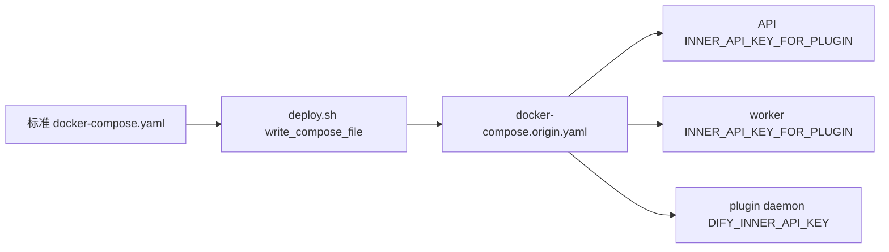

# Dify 自建环境部署脚本同步计划

Last Updated: 2026-07-16

状态源：`docs/engineering/specs/2026-07-14-dify-self-hosted-deployment-raw-requirements.md`。

## 状态清单

- [x] 核对故障链路、标准 Compose、部署脚本和远端容器环境。
  - 关注：`diagnosing-bugs`、`dev-spec-gen/references/testing-specs.md`。
  - 结论：自定义生成 Compose 漏掉 API/worker 的内部密钥映射。
- [x] 确认最小修改边界。
  - 关注：`general-specs.md`。
  - 仅同步 `INNER_API_KEY_FOR_PLUGIN`，不全量替换自定义 Compose。
- [x] 运行生成 Compose 红测，证明 API/worker 密钥映射缺失。
  - seam：`write_compose_file` 的生成结果。
  - 证据：生成模板解析结果为 `api=None worker=None`，plugin daemon 已引用同一密钥源，断言失败。
- [x] 最小修改 `docker/deploy.sh` 中 API/worker 的 `environment`。
- [x] 精确暂存本轮脚本、raw requirements 与 plan，并核对暂存区。
  - 证据：暂存区仅包含 `docker/deploy.sh` 与本轮两份状态源文档。
- [x] 执行生成 Compose 黑测、`bash -n` 和 `docker compose config`。
  - 生成结果：API、worker、plugin daemon 均引用 `${PLUGIN_DIFY_INNER_API_KEY}`。
  - `bash -n docker/deploy.sh` 通过。
  - 生成模板经 `docker compose --env-file .env -f - config -q` 解析通过。
- [x] 执行 Standards/Spec 审核。
  - 性能：不适用；仅部署配置映射。
  - 复用：复用现有 `PLUGIN_DIFY_INNER_API_KEY`，不新增密钥变量。
  - 安全：验证结果不得输出真实密钥。
  - 结论：Standards 0 项、Spec 0 项；修改与标准 Compose 的 API/worker 映射一致。
- [x] 获得用户执行远端部署的明确授权。
- [x] 使用 Git Bash 运行本地 `docker/deploy.sh`，完成镜像构建、文件同步、远端镜像加载和 Compose 更新。
  - 镜像归档本地与远端字节数均为 `1974450688`。
  - 初始命令达到 30 分钟执行上限时已完成传输并进入镜像加载；镜像加载成功后，从 `docker compose up -d` 安全续跑。
  - API、worker、worker beat、web、plugin daemon 与 sandbox 均已重建或更新。
- [x] 核对远端 API、worker、plugin daemon 容器状态及 API 健康检查。
  - `dify_origin-api-1` 状态为 healthy。
  - `http://10.1.14.177:5001/health` 返回 200，版本为 `1.15.0`。
- [x] 验证 API、worker 的 `INNER_API_KEY_FOR_PLUGIN` 与 plugin daemon 的 `DIFY_INNER_API_KEY` 已注入且一致。
  - 三处密钥均已设置，长度均为 30；仅比较长度和值是否一致，未输出密钥内容。
  - API 与 plugin daemon 一致；worker 与 plugin daemon 一致。
- [x] 验证 `POST /inner/api/invoke/llm` 不再因内部鉴权返回 404，并记录完整部署证据。
  - 使用 plugin daemon 当前内部密钥发起最小请求，接口返回 400 参数校验错误，证明已通过内部鉴权。
  - 新 API 容器最近 5 分钟该路由 404 数为 0，测试请求 400 数为 1。
- [x] 为工作流与应用总执行时长增加可覆盖的 `3600` 秒默认值。
  - seam：`write_runtime_env_file` 生成的远端运行时 `.env`。
  - 红测：生成结果中不存在 `APP_MAX_EXECUTION_TIME` 与 `WORKFLOW_MAX_EXECUTION_TIME`。
  - 黑测：两个配置项均生成为 `3600`，并允许本地 `.env` 覆盖默认值。
- [x] 执行 Bash 语法、运行时 `.env` 生成和 Compose 配置解析验证。
  - `bash -n docker/deploy.sh` 通过。
  - 生成的运行时 `.env` 两个限制值均为 `3600`。
  - 生成的 Compose 通过 `docker compose config -q`。
- [x] 同步远端部署文件，仅重建 API、worker，并核对容器实际环境值与健康状态。
  - 原图索引后台任务已完成 `263/263`，`committed=true` 后再执行重建。
  - API 与 worker 容器内 `APP_MAX_EXECUTION_TIME`、`WORKFLOW_MAX_EXECUTION_TIME` 均为 `3600`。
  - API 状态为 healthy，worker 状态为 running，`/health` 返回版本 `1.15.0`。
- [x] 记录部署证据、未验证项与剩余风险。
  - 未重新执行完整 263 分段图索引；需要用户从 Dify 页面发起下一次业务验收。
  - 重启后日志出现独立的模型参数错误：`max_tokens` 必须小于等于 256，与本次执行时长配置无关。
- [x] 将 plugin daemon 的 Gitea 同步宿主机目录改为 `GITEA_SYNC_HOST_TEMP_DIR`。
  - Compose 模板和实际 Compose 均只引用该变量；当前远端路径保留在被忽略的 `docker/.env`，示例环境使用相对路径。

## 正式交付文件

- `docker/deploy.sh`
- `docs/engineering/specs/2026-07-14-dify-self-hosted-deployment-raw-requirements.md`
- `docs/engineering/plans/2026-07-14-dify-self-hosted-deployment-plan.md`

## 迭代记录

- 2026-07-14：创建自建 Dify 部署脚本配置同步计划。
- 2026-07-14：完成远端部署与验收；内部调用鉴权 404 已消除。
- 2026-07-15：增加图索引工作流 3600 秒总执行时长配置并执行快速部署。
- 2026-07-16：Gitea 同步目录改由 `.env` 配置，消除 Compose 中的服务器路径硬编码。
