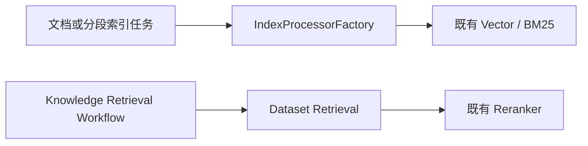

# Dify GraphRAG 可用化实施计划

Last Updated: 2026-07-19

状态源：`docs/engineering/specs/2026-07-16-graphrag-raw-requirements.md`。

## 当前结论

当前代码已经具备 Dataset 配置、Graph Job、Reconciler、LLM 抽取和 Neo4j 写入能力，最多只能完成“尝试构图”。图查询、候选 Segment 映射、向量与图融合、删除同步和真实端到端验收尚未完成，因此 GraphRAG 还不能参与 Dify 的实际知识库问答。

“图可以使用”的最低完成定义：

1. 启用 GraphRAG 的 Dataset 能稳定把现有和新增文档写入 Neo4j。
2. 用户问题能查询 Neo4j，并返回属于当前 Dataset 的有效 `segment_id`。
3. 图候选能进入 Dataset Retrieval，与向量/关键词候选融合并经过既有 Reranker。
4. Neo4j、抽图模型或 Graph Worker 异常时，基础检索自动降级且不受影响。
5. 文档更新、禁用、归档和删除后，旧图数据不再参与检索。

当前最短可用路径：

```text
修复 Job 可靠性
  -> 修正图写入与版本清理
  -> 补齐文档/Segment 生命周期
  -> 实现 Graph Retrieval
  -> 接入 Dataset Retrieval 融合
  -> 完成真实 Neo4j 端到端验收
```

## 当前状态审计

| 阶段 | 当前状态 | 结论 |
| --- | --- | --- |
| Phase 0：基线与扩展边界 | 已完成 | 独立 Graph 模块与独立配置表方案可继续使用 |
| Phase 1：配置、Schema、迁移、UI | 已实现，保存链路仍在回归修复 | 当前工作区仍有 Dataset PATCH 事务修复未完成验证 |
| Phase 2：Job、Reconciler、队列 | 已实现，存在阻塞缺陷 | Job 可能永久停在 `pending`，原子领取与重试契约未完成 |
| Phase 3：LLM 抽取与 Neo4j 写入 | 已实现，未完成可用性验收 | 缺少写入正确性、版本清理、正式测试和真实 Neo4j 验证 |
| Phase 4：状态查询与运维 | 未开始 | 不阻塞最小演示，阻塞生产运维 |
| Phase 5：Graph Retrieval | 未开始 | 图无法被用户问题查询，是核心功能缺口 |
| Phase 6：统一检索与降级 | 未开始 | 图结果无法参与回答，fail-open 配置未生效 |
| Phase 7：E2E、对账与升级演练 | 未开始 | 尚不能证明生产可用 |

## 实现路线校正

原方案要求优先通过 `plugin_daemon` 调用 `llamaindex_neo4j_graph`，且不增加 Python Neo4j/LlamaIndex 依赖。当前实现实际采用：

```text
Dify ModelManager
  -> 自定义 Prompt 与 JSON 解析
  -> neo4j 官方 Python Driver
  -> Neo4j
```

仓库已增加 `neo4j>=5.28.0,<6.0.0`，当前代码没有使用 LlamaIndex，也没有调用 `llamaindex_neo4j_graph`。第一期按现有直接 Adapter 打通最小可用链路；LlamaIndex/plugin Adapter 作为后续可替换实现。该决策需要同步补充到 ADR。

## Phase 0 基线结论



- 文档批量索引入口：`api/tasks/add_document_to_index_task.py`。
- 手工分段索引入口：`api/tasks/create_segment_to_index_task.py`。
- 更新、删除和清理入口位于 `api/tasks/document_indexing_*_task.py`、`delete_segment_from_index_task.py`、`clean_dataset_task.py`。
- 检索入口：`api/core/rag/retrieval/dataset_retrieval.py`；Workflow 适配入口：`api/core/workflow/nodes/knowledge_retrieval/retrieval.py`。
- 既有异步索引队列为 `dataset` 和 `priority_dataset`；Graph Worker 仅在 Phase 2 设计独立队列。
- Phase 1 启动时 LlamaIndex / Neo4j 尚未依赖，因此当时只建立不依赖具体图数据库的领域边界；当前实现状态见“实现路线校正”。

## ADR

决策见 `docs/engineering/2026-07-16-graphrag-extension-seams.md`：选择独立配置表与新增 GraphRAG 模块，不向 `datasets` 表追加 JSON 字段，也不改动现有索引或检索入口。

## Phase 1 清单

- [x] 建立 GraphRAG 领域对象和固定初始 Schema。
- [x] 建立 Dataset Graph 配置模型和导出入口。
- [x] 添加可逆 Alembic 迁移。
- [x] 添加默认关闭的全局配置。
- [x] 将 Neo4j 连接信息的 Docker 运行时来源收敛到 `docker/.env`。
  - 关注：`dev-spec-gen/references/environment-configuration-specs.md`。
  - `docker/.env.example` 与 `api/.env.example` 只提供脱敏变量契约；不在 Compose 或 Python 代码中复制实例连接信息。
  - `docker/.env` 已被 Docker Compose 的 API/worker `env_file` 引入，且受 `.gitignore` 排除。
  - 红测证明旧代码存在默认 URI；绿测证明未配置时连接字段为空、配置后从环境变量读取。
- [x] 将 GraphRAG 与 Neo4j 变量写入 `docker/deploy.sh` 生成的远端运行时 `.env` 并执行部署。
  - 关注：`dev-spec-gen/references/environment-configuration-specs.md`。
  - 验收：远端环境文件包含变量名；API 健康检查成功；不输出密码。
  - 2026-07-16 部署结果：`docker/deploy.sh` 在本地 Web 镜像的 `pnpm build` 阶段失败，尚未同步远端 `.env` 或重启远端服务。日志显示 `@base-ui/react/*` 与 `jotai` 模块无法解析；等待确认是否处理这一独立的 Web 构建依赖问题。
- [ ] 修复 Web Docker 构建的 workspace 开发依赖安装。
  - 变更：在 `web/Dockerfile` 的 `pnpm install --frozen-lockfile` 中显式追加 `--prod=false`。
  - 验收：`pnpm build && pnpm build:vinext` 成功，随后重新执行既有 `docker/deploy.sh`。
  - 2026-07-16 重试结果：API 镜像构建成功；Web 安装已开始下载全部 workspace 开发依赖，但 npm registry 多次连接重置、下载低速，最终在 `pnpm install --frozen-lockfile --prod=false` 超时退出。因此尚未能验证后续模块解析修复，远端未变更。
  - 2026-07-16 网络调整后重试：Docker Hub 仍出现 TLS 握手超时或 EOF；API 最终从缓存构建成功，但 Web 在 npm registry 下载期间再次超时。说明当前调整尚未覆盖 BuildKit 容器的 Docker Hub/npm 出网链路，远端仍未变更。
  - 2026-07-16 BuildKit 取证：`docker/.env` 声明了代理变量，但 `BUILDKIT_DAEMON_PROXY` 与 `BUILDKIT_REGISTRY_MIRROR` 均未配置，运行中的 BuildKit daemon 也没有代理环境变量。容器内直连 `auth.docker.io`、`registry-1.docker.io` 和 `registry.npmjs.org` 均成功；构建历史则确认 `HTTP_PROXY`、`HTTPS_PROXY` 被作为 build arg 注入。因此 Web 超时的首要假设是 pnpm 使用该 build proxy 后不稳定，而不是 BuildKit 缺少代理。后续修复应将 build proxy 改为显式、经连通性验证后才传入的 `BUILD_HTTP_PROXY` / `BUILD_HTTPS_PROXY`，或在直连可用时禁用这两个 build arg；不得直接向 BuildKit daemon 注入当前未验证的代理。
- [x] 禁止本地镜像构建注入通用代理变量。
  - 变更：移除 `docker/deploy.sh` 对 BuildKit daemon 和 API/Web Docker build arg 的 `HTTP_PROXY`、`HTTPS_PROXY`、`NO_PROXY` 注入；保留 `env -u`，确保 Docker CLI 自身也不继承这些变量。
  - 验收：构建记录不包含上述 build arg；API/Web 镜像构建完成后，再执行既有远端部署与健康检查。
  - 2026-07-16 验证结果：代理 build arg 已移除，API 镜像成功构建；Web 直连 npm registry 仍反复低速、连接错误并在 `pnpm install --frozen-lockfile --prod=false` 超时，Docker Hub 亦存在间歇性 EOF/TLS 超时。结论是代理注入不是唯一根因，当前直连公网链路不稳定；远端未变更。
- [x] 配置国内 Docker Hub BuildKit registry mirror。
  - 配置：在未托管 `docker/.env` 设置 `BUILDKIT_REGISTRY_MIRROR=docker.m.daocloud.io`；其 `/v2/` 返回 `401`，表明 Registry 认证挑战正常。
  - 生效方式：旧 `dify-origin-buildkit` builder 的删除请求在 Docker Desktop 中卡住，已停止卡住的本地 CLI 进程；改用 `dify-origin-buildkit-cn` 作为新的 builder 名称，由现有 `docker/deploy.sh` 创建并加载镜像配置。不在仓库示例文件中写入该环境专属地址。
  - 部署验证：新 builder 已成功开始 API 基础镜像及依赖层构建，未再停在 Docker Hub 元数据解析；但 `uv sync` 从 `files.pythonhosted.org` 下载 `tos==2.9.2` 超时。Docker registry mirror 只覆盖基础镜像，不覆盖 PyPI/npm，远端未变更。
- [x] 配置本地构建的国内 PyPI 与 npm 镜像。
  - 配置：`UV_INDEX_URL=https://pypi.tuna.tsinghua.edu.cn/simple`、`NPM_CONFIG_REGISTRY=https://registry.npmmirror.com` 保存在未托管 `docker/.env`；两个端点分别返回 `200`。
  - 实现：`docker/deploy.sh` 仅在变量非空时传递独立 build arg；API/Web Dockerfile 声明相应 `ARG`，不恢复通用代理，也不向运行时容器写入镜像地址。
  - 验收：API `uv sync` 不再访问 `files.pythonhosted.org` 超时，Web `pnpm install` 不再访问官方 npm registry 超时，随后完成既有远端部署与健康检查。
  - 验证进展：BuildKit 历史已确认两个 build arg 传入。一次 API 重试在生产层访问 `deb.nodesource.com` 时 TLS 失败；后续重试已越过 PyPI 阶段并完成 NLTK 的 GitHub 数据下载，但 BuildKit 容器内已无活跃执行任务后，`docker buildx build --load` 客户端与 `deploy.sh` 仍低 CPU 等待超过 40 分钟，构建记录保持 Running，尚未开始 Web 或远端同步。进程保持运行，未擅自终止。
  - 后续观察：重建 builder 后的 API 构建仍在官方 `deb.debian.org` 执行 `apt-get install` 超过 20 分钟；该步骤不使用 Docker、PyPI 或 npm 镜像。若本次构建不能自然完成，需要用户确认后单独配置国内 Debian 与 NodeSource 软件源。
  - 2026-07-16 国外网络恢复后重试：API 镜像已成功生成并更新本地 tag，但 `docker buildx build --load` 在本地导入阶段低 CPU、无网络等待，未进入 Web 构建或远端同步。已按用户授权终止卡住的本地客户端；远端未变更。
  - 2026-07-16 Docker Desktop 重启后复现：`--load` 导入仍卡住且本地镜像时间戳未更新。部署脚本改为 `--output type=docker,dest=<临时 tar>` 后显式 `docker load`，用于绕过该本地导入阻塞；需重新执行部署验证。
  - 2026-07-16 tar 导出验证：API 构建阶段可完成并生成新的本地 API 镜像，但 `type=docker` tar 导出同样未生成临时文件，buildx 客户端长时间低 CPU 等待。已按用户授权终止本地客户端；远端未变更。
  - 2026-07-16 Docker 升级后重试：Docker Hub 与 API 构建成功；Web 的 `NPM_CONFIG_REGISTRY` build arg 已传入但未导出为 pnpm 进程环境，日志仍访问 `registry.npmjs.org` 并超时。已补充显式环境导出，需再次验证。
  - 2026-07-16 环境导出验证：pnpm 已读取 `NPM_CONFIG_REGISTRY`，但 frozen lockfile 中的 tarball URL 仍固定为 `registry.npmjs.org`。新增仅针对容器内复制锁文件的域名替换，不修改仓库锁文件；需再次验证。
  - 2026-07-16 npm 镜像验证：npmmirror tarball 正确跳转到 `cdn.npmmirror.com`，但 pnpm 仍选择官方 registry；改为显式传递 `pnpm install --registry=...`，需再次验证。
  - 部署验证通过：pnpm 安装与 Web/​Vinext 构建完成，远端 API、worker、worker_beat、web、sandbox、plugin_daemon 和 ssrf_proxy 均运行；API `/health` 返回 `{"pid":8,"status":"ok","version":"1.15.0"}`。
  - 2026-07-17 重新部署：API/Web BuildKit 构建完成，远端全部服务重建并正常运行；Alembic 版本为 `e7f4a9b2c6d1 (head)`，API `/health` 返回 `{"status":"ok","version":"1.15.0"}`。发现并修正未托管 `docker/.env` 中的双等号配置，远端运行时 `NEO4J_URI` 已核实为 `neo4j://10.1.14.158:7687`。
  - 2026-07-16 pnpm registry 验证：国内 npm 安装已完成；Web 编译暴露 workspace peer 依赖路径问题，`@base-ui/react/*` 与 `jotai` 在包物理路径不可解析。构建命令追加 `--shamefully-hoist`，仅调整 Docker 构建依赖布局，不修改业务包依赖契约。
- [x] 编写并运行定向单元测试。
  - 红测：GraphRAG 模块和配置不存在时，两个新增测试文件在收集阶段失败。
  - 绿测：`8 passed`，覆盖 Schema、单跳查询、配置默认值和数据库唯一约束。
- [x] 审计 diff，确认不混入现有脏工作区改动。
  - 新增实现未触及 `IndexProcessorFactory`、索引任务、Dataset Retrieval、Workflow 或 Reranker。
  - Ruff 检查和格式检查通过；迁移文件已通过 Python 语法编译。
- [x] 在 Dataset 设置页增加 GraphRAG 开关和抽图关键配置并持久化 Dataset 配置。
  - API：Dataset 详情返回 `graph_rag_config`，更新接口保存到独立 `dataset_graph_configs` 表；保留 `graph_rag_enabled` 兼容字段。
  - UI：复用现有 Dataset 设置页保存流程、权限和 i18n；默认关闭。
  - 抽图配置：以结构化字段暴露 LlamaIndex 抽图模型和抽取限制；`extract_model_config` 由表单生成，不暴露原始 JSON。
  - 升级隔离：新增 `web/app/components/datasets/graph-rag/graph-rag-settings.tsx` 承载图配置表单，既有 `indexing-section.tsx` 只保留挂载点。
  - [x] 将同一 GraphRAG 配置组件接入 Dataset 创建页 Step Two；创建请求校验失败时中断后续文档索引流程。
  - [x] 抽图模型改用 Dify 供应商配置的 ModelSelector，禁止自由填写模型名。
  - 验收：修改配置并重新进入页面后状态保持；超出字段约束时不发请求；全局开关关闭时不改变现有索引/检索行为。
- [x] 按用户补充要求调整图配置 UI，使数值参数复用检索设置的 `ParamItem` 交互（数字输入、步进、滑块、禁用态），保持 GraphRAG 字段契约和保存流程不变。
  - 参考实现：`web/app/components/base/param-item/index.tsx`、`web/app/components/datasets/external-knowledge-base/create/RetrievalSettings.tsx`。
  - 验收：图 Top K、最大深度、超时、权重和抽图温度/三元组数不再使用裸输入作为主要控件；只读/关闭态行为保持。
  - 2026-07-17 验证：GraphRAG validation 测试 `4 passed`；索引设置组件回归测试 `24 passed`；GraphRAG 组件 ESLint 通过；前端 `pnpm type-check` 通过。

## P0：把图真正用起来前必须完成

### P0-1 修复 Graph Job 事务、投递与重试闭环

当前已确认问题：

1. Reconciler 在数据库事务提交前调用 Celery `delay`。Worker 可能先于提交执行，读取不到 Job 后退出。
2. 已存在的 `pending` Job 不会再次投递；恢复后的 `retry_waiting` 或超时 `running` Job 只被改回 `pending`，没有重新派发。
3. Repository 的 `claim()` 采用“查询后修改”，没有条件更新或行锁，不满足原子领取契约。
4. Worker 在同一数据库事务中执行 LLM 和 Neo4j 外部 I/O，事务持有时间过长，且 `running` 状态在提交前不可见。
5. `GRAPH_INDEX_MAX_RETRIES` 尚未生效；`available_at` 与指数退避也没有被严格执行。
6. 并发幂等插入冲突会回滚外层 Session，和仓储注释中的嵌套事务契约不一致。

必须完成：

- Job 事务提交后再派发，可采用 after-commit dispatcher 或独立 Outbox；禁止提交前派发。
- Repository 增加“查询当前可派发 Job”能力，Reconciler 统一重新派发 `pending`、到期 `retry_waiting` 和恢复后的 stale Job。
- 使用条件更新或 `SELECT ... FOR UPDATE` 完成原子领取，仅允许一次 `pending -> running` 成功。
- Worker 拆分为三段事务：领取并提交、执行外部 I/O、记录终态并提交。
- 严格判断 `available_at <= now`，实现指数退避和最大重试次数；达到上限后进入 `failed`。
- 幂等插入使用 savepoint/嵌套事务，唯一键冲突不能破坏外层 Reconciler 事务。

验收：

- Job 提交前启动 Worker 不会丢任务。
- 同一 Job 并发消费时只有一个 Worker 获得执行权。
- Celery 派发失败后，下一轮 Reconciler 能重新派发。
- Worker 崩溃后，超时 Job 能恢复并重新执行。
- 重试等待和最大次数符合配置。

### P0-2 修正图数据模型和写入正确性

当前已确认问题：

1. 同一事实由多个 Segment 支撑时，关系上的单个 `segment_id` 会被后续写入覆盖，无法保留多证据。
2. 新 `source_version` 或 `graph_version` 写入后，没有清理旧版本中已经不存在的实体、关系和 MENTIONS 证据。
3. `Segment` 节点缺少完整的 tenant、dataset、document、graph_version 隔离字段。
4. `max_triplets_per_chunk` 和 `strict` 已保存到配置，抽取逻辑尚未实际使用。
5. 尚未发现 Neo4j 唯一约束和查询索引初始化。
6. `run_indexer`、Neo4j Writer、Cypher 参数和失败映射没有正式单元测试或集成测试。

必须完成：

- 将“事实关系”和“Segment 证据”分离，确保一个事实可关联多个 Segment，禁止单值覆盖证据。
- 所有图节点和证据关系带 `tenant_id`、`dataset_id`、`document_id`、`graph_version`，查询时强制过滤。
- 文档新版本全部写入成功后再清理旧版本；写入失败时保留上一个成功版本。
- 抽取数量受 `max_triplets_per_chunk` 限制，并明确 `strict=true/false` 的运行语义。
- 增加 Entity、Segment、证据关系的唯一约束与 Dataset/版本查询索引。
- 增加 Indexer/Writer 单元测试和临时 Neo4j 集成测试，不连接生产库或共享测试库。

实施模型：

```text
(GraphSegment)-[:MENTIONS]->(GraphEntity)
(GraphSegment)-[:EVIDENCE_FOR]->(GraphFact)
(GraphEntity)-[:FACT_SOURCE]->(GraphFact)-[:FACT_TARGET]->(GraphEntity)
```

- `GraphEntity`、`GraphFact`、`GraphSegment` 均以 tenant、Dataset、Document、`graph_version`、`source_version` 作为隔离和版本边界。
- `GraphFact.relation` 保存业务关系类型，不再把 LLM 关系值直接作为 Neo4j 动态关系类型。
- 同一事实由多个 Segment 支撑时，共享一个 `GraphFact`，每个 Segment 分别建立 `EVIDENCE_FOR`。
- 每次 Segment 写入在单个 Neo4j 事务内替换该 Segment 的当前版本证据，并清理当前版本中失去证据的孤儿事实/实体，避免 LLM 重试结果变化时累积脏图。
- 同一 Document 的不同 `source_version` Job 通过 Document 行锁串行领取；写入前后再次核对当前版本，过期 Job 精确清理自身临时图并进入 `cancelled`，避免旧 Job 晚完成后覆盖新图。
- 单个 Job 的全部 Segment 写入成功后才执行版本切换：删除同文档的旧 `source_version`/`graph_version`；任一写入失败时不清理旧版本。
- `strict=true` 时严格执行 `allowed_triples`；`strict=false` 时仍限制实体类型和关系类型，但允许声明类型之间的非模板组合。
- `max_triplets_per_chunk` 在 schema 过滤和去重后截断，保证单 Segment 的实际写入上限。
- 未来 Graph Retrieval 只读取 Job 状态为 `succeeded`、且与当前 Document source_version 一致的 `GraphEntity`、`GraphFact`、`GraphSegment`；重试、取消或已经过期的版本不得参与查询。
- 旧版 `Entity`/`Segment` 数据不进入新查询链路，清理动作放入重建/生命周期阶段。

验收：

- 同一关系由两个 Segment 支撑时能返回两个证据 Segment。
- 文档删除一条关系后重新索引，旧关系不再命中。
- 不同 tenant 或 Dataset 的同名实体不会串图。
- 相同 Job 重复执行不产生重复节点、事实或证据。

### P0-3 补齐文档与 Segment 生命周期同步

实施结果：

- Reconciler 在数据库事务提交后执行 Dataset 图对账，删除已删除、归档、禁用或索引失效的 Document/Segment 图对象，并清理孤儿 Fact/Entity。
- `source_version` 已包含排序后的有效 Segment ID、正文 SHA-256 和更新时间，Segment 内容或集合变化都会创建新 Job。
- 活动文档的旧图保留到新版本全部写入成功，避免重建失败导致知识库暂时无图可用。
- Dataset 关闭 GraphRAG 时停止构图和图检索并保留数据；显式清空 API/页面入口仍归 T6 运维能力。

必须完成：

- 增加 `index`、`delete_document`、`delete_segment`、`rebuild` 等 Job 类型，或建立等价的生命周期命令模型。
- Reconciler 同时对账当前有效 Segment 和 Neo4j 证据，清理孤儿与过期数据。
- `source_version` 改为稳定的 Segment 内容哈希，或用自动化测试证明所有内容修改入口都会更新当前版本事实。
- 第一期开关关闭策略统一为：停止构图和图检索，保留图数据；另提供显式清空动作。

验收：

- 文档更新后只检索到新内容对应的图证据。
- 文档或 Segment 删除、归档、禁用后不再返回对应结果。
- Reconciler 能发现并清理 Neo4j 孤儿数据。

本轮验证：disposable Neo4j 已真实验证 Segment 删除、Document 删除、孤儿清理和版本替换；显式清空操作入口未实现。

### P0-4 实现安全、可降级的 Graph Retrieval

新增模块建议：

```text
api/core/rag/graph_retrieval/
  query_analyzer.py
  neo4j_reader.py
  service.py
  fusion.py
```

必须完成：

1. Query Analyzer 从用户问题提取最多 5 个实体候选和可选关系类型，输出通过 `GraphQuery` 校验。
2. Neo4j Reader 只使用固定一跳 Cypher 模板，不开放 Text-to-Cypher；所有值均参数化。
3. 查询强制过滤 tenant、dataset 和当前成功 `graph_version`。
4. 返回 `segment_id`、图距离、路径、命中实体和关系，并映射为 `GraphResult`。
5. 返回前回查 Dify 数据库，只保留当前启用、未删除、属于当前 Dataset 的 Segment。
6. 严格执行 `graph_top_k` 和 `graph_timeout_ms`。
7. Neo4j、查询分析模型或解析异常时，按 `GRAPH_RAG_FAIL_OPEN=true` 返回空图候选并继续基础检索。

验收：

- 已知实体问题能稳定命中预期 Segment。
- 不同 tenant/Dataset 无法通过同名实体读取对方结果。
- Neo4j 超时、断连和空结果不会中断普通检索。
- 查询日志包含 Dataset、耗时、候选数和降级原因，不记录凭据。

实施结果：Query Analyzer、固定参数化一跳 Reader、当前成功版本过滤、Dify Segment 回查、`graph_top_k`、客户端查询超时和 fail-open 均已进入实际调用链。真实模型不可用时会回退到本地关键词；本轮 disposable Neo4j 已验证该回退仍能命中图候选。真实配置模型调用仍待稳定 Linux 环境验证。

### P0-5 接入 Dataset Retrieval 和既有 Reranker

必须完成：

- Dataset 配置为 `vector` 时保持上游现有行为，不调用 Neo4j。
- 配置为 `hybrid` 且全局/Dataset 开关同时开启时，并行执行基础检索和 Graph Retrieval。
- 将向量、关键词、图结果统一映射为 `KnowledgeCandidate`。
- 使用 RRF 或等价排名融合；`graph_weight` 必须具有明确、可测试的计算语义。
- 融合后继续使用 Dify 既有 Reranker，不修改 Workflow Knowledge Retrieval 对外协议。
- Graph Retrieval 超时只丢弃图候选，不阻断基础候选返回。

最小上游 Hook：

```text
api/core/rag/retrieval/dataset_retrieval.py
```

该 Hook 只调用新增 Graph Retrieval/Fusion 服务，图查询与融合细节不得散落到 Workflow 节点。

验收：

- 覆盖仅向量命中、仅图命中、两者同时命中和重复 Segment 四类测试。
- 同一 Segment 被多路召回时只返回一份，并保留来源和排名元数据。
- GraphRAG 全局关闭或 Dataset 关闭时，结果与上游基础检索一致。

实施结果：Workflow Knowledge Retrieval、Agent 单库/多库 Dataset Tool 和知识库命中测试均已接入公开 `DatasetRetrieval.augment_with_graph` 扩展 seam；仅图命中可直接形成问答上下文，图候选与基础候选通过加权 RRF 去重融合，并在启用时继续进入既有 `DataPostProcessor`/Reranker。

兼容性决策：运行时统一候选继续使用上游 `Document`，而不是强制转换为 `KnowledgeCandidate`。`Document.metadata.doc_id` 是现有向量节点及 parent-child 检索的真实身份键，强制以 Segment DTO 中转会丢失上游格式化与父子块语义。`KnowledgeCandidate` 暂保留为未来跨检索后端 DTO。

性能余项：基础检索与 Graph Retrieval 当前顺序执行，功能和 fail-open 已完成；并行执行保留为后续性能优化，不阻塞知识库问答使用。

### P0-6 完成真实端到端验收

必须在稳定 Linux/容器环境完成：

1. 执行全部 Graph migration，确认 Alembic 只有一个 head。
2. 启动 API、Beat、可消费 `graph_index` 的 Worker 和 Neo4j。
3. 创建测试 Dataset，启用 GraphRAG 并选择可用 LLM。
4. 上传包含明确产品、模块、功能和错误关系的测试文档。
5. 验证 Job 从 `pending -> running -> succeeded`。
6. 只读查询 Neo4j，核对节点、关系、Segment 证据和版本字段。
7. 调用知识库检索 API，证明至少一个候选来自图召回。
8. 更新文档，证明旧图被替换。
9. 删除文档，证明图数据被清理。
10. 停止 Neo4j，证明基础向量检索仍可用并记录降级原因。

没有以上业务证据，不得将 GraphRAG 标记为“可用”。

## P1：生产可维护性

P0 完成后继续：

- 增加 Dataset Graph 状态 API：等待、运行、成功、失败数量，最后成功时间、当前版本和最近错误。
- 增加按 Dataset/Document 的重试、取消、重建和清理入口。
- 将 `graph_index` 放到独立 Worker 进程，真正隔离普通 Dataset Worker；应用 `GRAPH_INDEX_WORKER_CONCURRENCY`。
- 增加任务耗时、模型调用、三元组数量、Neo4j 写入、查询命中和降级指标。
- 增加 Neo4j 健康检查、超时、连接池上限和熔断策略。
- 增加失败 Job 保留周期、错误脱敏和审计清理策略。
- 在 Dataset 页面显示图索引状态和手工重建入口。
- 完成 upstream 差异审计和升级检查清单。

## 执行顺序与当前 Frontier

| Ticket | 内容 | 依赖 | 当前状态 |
| --- | --- | --- | --- |
| T0 | 更新 ADR 与状态源，确认第一期采用直接 ModelManager + Neo4j Adapter | 无 | 已完成 |
| T1 | 修复提交后派发、重新派发、原子领取、重试上限和事务拆分 | T0 | 已实现，待 Linux/Celery 集成验证 |
| T2 | 修正多 Segment 证据、版本替换、约束索引和 Phase 3 测试 | T1 | 已完成 disposable Neo4j 写入/读取验证 |
| T3 | 实现文档/Segment 更新删除同步与对账清理 | T2 | 核心生命周期已完成；显式清空入口归 T6 |
| T4 | 实现 Graph Retrieval 和安全 Neo4j Reader | T2 | 已完成并通过 disposable Neo4j 查询验证 |
| T5 | 接入 Dataset Retrieval、融合和 fail-open | T4 | 已完成；问答、Agent Tool、命中测试均已接入 |
| T6 | 状态 API、独立 Worker、指标和运维入口 | T1 | 当前可并行 Frontier |
| T7 | Linux/容器真实 Neo4j E2E、故障降级和删除验收 | T3、T5 | 当前生产验收 Frontier；已完成 disposable 子集 |
| T8 | upstream 升级演练与发布检查 | T7 | 阻塞 |

## 后续可选能力

以下能力不阻塞第一期使用：

- 普通索引完成后的实时 Hook；Reconciler 仍作为正确性兜底。
- 使用 LlamaIndex/plugin_daemon Adapter 替换当前直接 Adapter。
- 两跳及以上路径查询。
- Text-to-Cypher。
- 图社区摘要、PageRank、中心性和社区发现。
- 图谱可视化编辑器。
- 使用 Neo4j 替代现有向量库存储。

## 当前验证记录

- 本地 `docker/.env` 中 `GRAPH_RAG_ENABLED=true`、`ENABLE_GRAPH_RECONCILE_TASK=true`，Neo4j 四项连接配置均已设置。该证据只能证明配置存在，不能证明 Neo4j 可连接或业务链路成功。
- 2026-07-19 完成 T1 单元级实现：Reconciler 事务提交后派发；可重新派发当前启用 Dataset、当前 `graph_version` 的到期 `pending` Job；Worker 使用条件更新原子领取，并将领取、外部 I/O、结果持久化拆成独立阶段。
- 重试已执行 `available_at`、指数退避和 `GRAPH_INDEX_MAX_RETRIES`；并发唯一键冲突使用 savepoint，避免回滚 Reconciler 外层事务。
- 2026-07-19 完成 T2 单元级实现：图模型调整为 `GraphEntity`、`GraphFact`、`GraphSegment`，事实和 Segment 证据分离；写入显式携带 tenant、Dataset、Document、`graph_version`、`source_version`。
- 同一事实可由多个 Segment 建立独立 `EVIDENCE_FOR`；相同 Segment 重试时先替换当前版本证据，再清理孤儿事实和实体；全部 Segment 成功后才删除文档旧版本。
- `strict` 和 `max_triplets_per_chunk` 已进入 Prompt、过滤、去重和截断链路；Neo4j 初始化增加 3 个复合唯一约束和 3 个查询索引。
- T3/T4/T5 定向组合回归覆盖 Graph Indexing、生命周期、Graph Retrieval、完整 Dataset Retrieval、Agent 单库/多库 Tool 和 Hit Testing，结果为 `290 passed`；新增本地关键词回退测试单独为 `4 passed`。
- disposable Neo4j 5.26 容器真实验证输出 `DISPOSABLE_NEO4J_GRAPH_VERIFICATION_PASSED`：约束/索引创建、多 Segment 证据、幂等、Reader 查询、版本替换、Segment 删除和 Document 删除均通过。
- disposable Neo4j + 内存 Dify DB 真实组合验证输出 `DISPOSABLE_NEO4J_QA_RETRIEVAL_VERIFICATION_PASSED`：模型调用失败后使用本地关键词，图候选经当前版本校验、Segment 回查和 Dataset Retrieval 融合，最终形成可供问答使用的 `Document`。
- GraphRAG 主调用链已覆盖 Workflow Knowledge Retrieval、Agent Dataset Tool、Multi Dataset Tool 和知识库 Hit Testing；`vector` 模式或开关关闭时保持基础检索行为。
- fail-open、超时和断连路径已由单元测试覆盖；尝试对不可达 Neo4j 做物理验证时 DevSpace 返回 502，当前没有真实断连集成通过证据。
- mypy 定向检查此前多次被 DevSpace 502 阻塞，当前没有类型检查通过证据。
- 扩大到 Dataset 控制器测试时，Windows `python-magic` 在模块导入阶段触发 access violation；该项仍需在稳定 Linux/容器环境补跑。
- 基础检索与图检索尚未并行；真实 LLM Query Analyzer、API/Beat/Worker 完整 Linux 链路和生产故障降级仍属于 T7。
- 当前工作区存在用户先前未提交修改和临时文件；后续实现必须精确审计 diff，不得混入无关变更。

## 完成标准

只有同时满足以下条件，才可以宣布第一期 GraphRAG 可用：

- [ ] Job 不丢失、可重试、可恢复，且不会被多个 Worker 重复并发执行。
- [x] 图写入保留多 Segment 证据，支持版本替换和幂等重建（单元测试 + disposable Neo4j）。
- [x] 文档/Segment 更新、禁用、归档和删除能同步清理图数据（核心对账已实现并完成 disposable Neo4j 验证）。
- [x] Graph Retrieval 能安全返回当前 tenant、Dataset 的有效 Segment（单元测试 + disposable Neo4j/内存 DB）。
- [x] 图候选进入统一检索并经过既有 Reranker（Workflow、Agent Tool、Hit Testing 已接入）。
- [x] Neo4j 或图模型失败时自动降级到基础检索（单元测试；真实断连集成仍待 T7）。
- [ ] 稳定 Linux/容器环境完成新增、更新、删除、检索和故障 E2E。
- [ ] GraphRAG 关闭时行为与上游 Dify 基础检索一致。
- [ ] 状态源、测试与代码不存在互相冲突的阶段描述。
