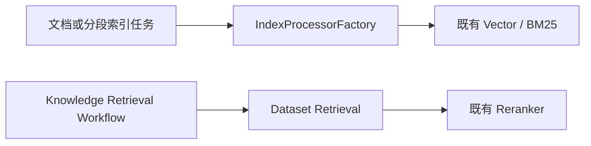

# Dify GraphRAG Phase 0-1 实施计划

Last Updated: 2026-07-17

状态源：`docs/engineering/specs/2026-07-16-graphrag-raw-requirements.md`。

## Phase 0 基线结论



- 文档批量索引入口：`api/tasks/add_document_to_index_task.py`。
- 手工分段索引入口：`api/tasks/create_segment_to_index_task.py`。
- 更新、删除和清理入口位于 `api/tasks/document_indexing_*_task.py`、`delete_segment_from_index_task.py`、`clean_dataset_task.py`。
- 检索入口：`api/core/rag/retrieval/dataset_retrieval.py`；Workflow 适配入口：`api/core/workflow/nodes/knowledge_retrieval/retrieval.py`。
- 既有异步索引队列为 `dataset` 和 `priority_dataset`；Graph Worker 仅在 Phase 2 设计独立队列。
- LlamaIndex / Neo4j 尚未依赖，因此 Phase 1 只建立不依赖具体图数据库的领域边界。

## ADR

决策见 `docs/engineering/2026-07-16-graphrag-extension-seams.md`：选择独立配置表与新增 GraphRAG 模块，不向 `datasets` 表追加 JSON 字段，也不改动现有索引或检索入口。

## Phase 1 清单

- [x] 建立 GraphRAG 领域对象和固定初始 Schema。
- [x] 建立 Dataset Graph 配置模型和导出入口。
- [x] 添加可逆 Alembic 迁移。
- [x] 添加默认关闭的全局配置。
- [x] 将 Neo4j 连接信息的 Docker 运行时来源收敛到 `docker/.env`。
  - 关注：`dev-spec-gen/references/environment-configuration-specs.md`。
  - `docker/.env.example` 与 `api/.env.example` 只提供脱敏变量契约；不在 Compose 或 Python 代码中复制实例连接信息。
  - `docker/.env` 已被 Docker Compose 的 API/worker `env_file` 引入，且受 `.gitignore` 排除。
  - 红测证明旧代码存在默认 URI；绿测证明未配置时连接字段为空、配置后从环境变量读取。
- [x] 将 GraphRAG 与 Neo4j 变量写入 `docker/deploy.sh` 生成的远端运行时 `.env` 并执行部署。
  - 关注：`dev-spec-gen/references/environment-configuration-specs.md`。
  - 验收：远端环境文件包含变量名；API 健康检查成功；不输出密码。
  - 2026-07-16 部署结果：`docker/deploy.sh` 在本地 Web 镜像的 `pnpm build` 阶段失败，尚未同步远端 `.env` 或重启远端服务。日志显示 `@base-ui/react/*` 与 `jotai` 模块无法解析；等待确认是否处理这一独立的 Web 构建依赖问题。
- [ ] 修复 Web Docker 构建的 workspace 开发依赖安装。
  - 变更：在 `web/Dockerfile` 的 `pnpm install --frozen-lockfile` 中显式追加 `--prod=false`。
  - 验收：`pnpm build && pnpm build:vinext` 成功，随后重新执行既有 `docker/deploy.sh`。
  - 2026-07-16 重试结果：API 镜像构建成功；Web 安装已开始下载全部 workspace 开发依赖，但 npm registry 多次连接重置、下载低速，最终在 `pnpm install --frozen-lockfile --prod=false` 超时退出。因此尚未能验证后续模块解析修复，远端未变更。
  - 2026-07-16 网络调整后重试：Docker Hub 仍出现 TLS 握手超时或 EOF；API 最终从缓存构建成功，但 Web 在 npm registry 下载期间再次超时。说明当前调整尚未覆盖 BuildKit 容器的 Docker Hub/npm 出网链路，远端仍未变更。
  - 2026-07-16 BuildKit 取证：`docker/.env` 声明了代理变量，但 `BUILDKIT_DAEMON_PROXY` 与 `BUILDKIT_REGISTRY_MIRROR` 均未配置，运行中的 BuildKit daemon 也没有代理环境变量。容器内直连 `auth.docker.io`、`registry-1.docker.io` 和 `registry.npmjs.org` 均成功；构建历史则确认 `HTTP_PROXY`、`HTTPS_PROXY` 被作为 build arg 注入。因此 Web 超时的首要假设是 pnpm 使用该 build proxy 后不稳定，而不是 BuildKit 缺少代理。后续修复应将 build proxy 改为显式、经连通性验证后才传入的 `BUILD_HTTP_PROXY` / `BUILD_HTTPS_PROXY`，或在直连可用时禁用这两个 build arg；不得直接向 BuildKit daemon 注入当前未验证的代理。
- [x] 禁止本地镜像构建注入通用代理变量。
  - 变更：移除 `docker/deploy.sh` 对 BuildKit daemon 和 API/Web Docker build arg 的 `HTTP_PROXY`、`HTTPS_PROXY`、`NO_PROXY` 注入；保留 `env -u`，确保 Docker CLI 自身也不继承这些变量。
  - 验收：构建记录不包含上述 build arg；API/Web 镜像构建完成后，再执行既有远端部署与健康检查。
  - 2026-07-16 验证结果：代理 build arg 已移除，API 镜像成功构建；Web 直连 npm registry 仍反复低速、连接错误并在 `pnpm install --frozen-lockfile --prod=false` 超时，Docker Hub 亦存在间歇性 EOF/TLS 超时。结论是代理注入不是唯一根因，当前直连公网链路不稳定；远端未变更。
- [x] 配置国内 Docker Hub BuildKit registry mirror。
  - 配置：在未托管 `docker/.env` 设置 `BUILDKIT_REGISTRY_MIRROR=docker.m.daocloud.io`；其 `/v2/` 返回 `401`，表明 Registry 认证挑战正常。
  - 生效方式：旧 `dify-origin-buildkit` builder 的删除请求在 Docker Desktop 中卡住，已停止卡住的本地 CLI 进程；改用 `dify-origin-buildkit-cn` 作为新的 builder 名称，由现有 `docker/deploy.sh` 创建并加载镜像配置。不在仓库示例文件中写入该环境专属地址。
  - 部署验证：新 builder 已成功开始 API 基础镜像及依赖层构建，未再停在 Docker Hub 元数据解析；但 `uv sync` 从 `files.pythonhosted.org` 下载 `tos==2.9.2` 超时。Docker registry mirror 只覆盖基础镜像，不覆盖 PyPI/npm，远端未变更。
- [x] 配置本地构建的国内 PyPI 与 npm 镜像。
  - 配置：`UV_INDEX_URL=https://pypi.tuna.tsinghua.edu.cn/simple`、`NPM_CONFIG_REGISTRY=https://registry.npmmirror.com` 保存在未托管 `docker/.env`；两个端点分别返回 `200`。
  - 实现：`docker/deploy.sh` 仅在变量非空时传递独立 build arg；API/Web Dockerfile 声明相应 `ARG`，不恢复通用代理，也不向运行时容器写入镜像地址。
  - 验收：API `uv sync` 不再访问 `files.pythonhosted.org` 超时，Web `pnpm install` 不再访问官方 npm registry 超时，随后完成既有远端部署与健康检查。
  - 验证进展：BuildKit 历史已确认两个 build arg 传入。一次 API 重试在生产层访问 `deb.nodesource.com` 时 TLS 失败；后续重试已越过 PyPI 阶段并完成 NLTK 的 GitHub 数据下载，但 BuildKit 容器内已无活跃执行任务后，`docker buildx build --load` 客户端与 `deploy.sh` 仍低 CPU 等待超过 40 分钟，构建记录保持 Running，尚未开始 Web 或远端同步。进程保持运行，未擅自终止。
  - 后续观察：重建 builder 后的 API 构建仍在官方 `deb.debian.org` 执行 `apt-get install` 超过 20 分钟；该步骤不使用 Docker、PyPI 或 npm 镜像。若本次构建不能自然完成，需要用户确认后单独配置国内 Debian 与 NodeSource 软件源。
  - 2026-07-16 国外网络恢复后重试：API 镜像已成功生成并更新本地 tag，但 `docker buildx build --load` 在本地导入阶段低 CPU、无网络等待，未进入 Web 构建或远端同步。已按用户授权终止卡住的本地客户端；远端未变更。
  - 2026-07-16 Docker Desktop 重启后复现：`--load` 导入仍卡住且本地镜像时间戳未更新。部署脚本改为 `--output type=docker,dest=<临时 tar>` 后显式 `docker load`，用于绕过该本地导入阻塞；需重新执行部署验证。
  - 2026-07-16 tar 导出验证：API 构建阶段可完成并生成新的本地 API 镜像，但 `type=docker` tar 导出同样未生成临时文件，buildx 客户端长时间低 CPU 等待。已按用户授权终止本地客户端；远端未变更。
  - 2026-07-16 Docker 升级后重试：Docker Hub 与 API 构建成功；Web 的 `NPM_CONFIG_REGISTRY` build arg 已传入但未导出为 pnpm 进程环境，日志仍访问 `registry.npmjs.org` 并超时。已补充显式环境导出，需再次验证。
  - 2026-07-16 环境导出验证：pnpm 已读取 `NPM_CONFIG_REGISTRY`，但 frozen lockfile 中的 tarball URL 仍固定为 `registry.npmjs.org`。新增仅针对容器内复制锁文件的域名替换，不修改仓库锁文件；需再次验证。
  - 2026-07-16 npm 镜像验证：npmmirror tarball 正确跳转到 `cdn.npmmirror.com`，但 pnpm 仍选择官方 registry；改为显式传递 `pnpm install --registry=...`，需再次验证。
  - 部署验证通过：pnpm 安装与 Web/​Vinext 构建完成，远端 API、worker、worker_beat、web、sandbox、plugin_daemon 和 ssrf_proxy 均运行；API `/health` 返回 `{"pid":8,"status":"ok","version":"1.15.0"}`。
  - 2026-07-17 重新部署：API/Web BuildKit 构建完成，远端全部服务重建并正常运行；Alembic 版本为 `e7f4a9b2c6d1 (head)`，API `/health` 返回 `{"status":"ok","version":"1.15.0"}`。发现并修正未托管 `docker/.env` 中的双等号配置，远端运行时 `NEO4J_URI` 已核实为 `neo4j://10.1.14.158:7687`。
  - 2026-07-16 pnpm registry 验证：国内 npm 安装已完成；Web 编译暴露 workspace peer 依赖路径问题，`@base-ui/react/*` 与 `jotai` 在包物理路径不可解析。构建命令追加 `--shamefully-hoist`，仅调整 Docker 构建依赖布局，不修改业务包依赖契约。
- [x] 编写并运行定向单元测试。
  - 红测：GraphRAG 模块和配置不存在时，两个新增测试文件在收集阶段失败。
  - 绿测：`8 passed`，覆盖 Schema、单跳查询、配置默认值和数据库唯一约束。
- [x] 审计 diff，确认不混入现有脏工作区改动。
  - 新增实现未触及 `IndexProcessorFactory`、索引任务、Dataset Retrieval、Workflow 或 Reranker。
  - Ruff 检查和格式检查通过；迁移文件已通过 Python 语法编译。
- [x] 在 Dataset 设置页增加 GraphRAG 开关和抽图关键配置并持久化 Dataset 配置。
  - API：Dataset 详情返回 `graph_rag_config`，更新接口保存到独立 `dataset_graph_configs` 表；保留 `graph_rag_enabled` 兼容字段。
  - UI：复用现有 Dataset 设置页保存流程、权限和 i18n；默认关闭。
  - 抽图配置：以结构化字段暴露 LlamaIndex 抽图模型和抽取限制；`extract_model_config` 由表单生成，不暴露原始 JSON。
  - 升级隔离：新增 `web/app/components/datasets/graph-rag/graph-rag-settings.tsx` 承载图配置表单，既有 `indexing-section.tsx` 只保留挂载点。
  - [x] 将同一 GraphRAG 配置组件接入 Dataset 创建页 Step Two；创建请求校验失败时中断后续文档索引流程。
  - [x] 抽图模型改用 Dify 供应商配置的 ModelSelector，禁止自由填写模型名。
  - 验收：修改配置并重新进入页面后状态保持；超出字段约束时不发请求；全局开关关闭时不改变现有索引/检索行为。
- [x] 按用户补充要求调整图配置 UI，使数值参数复用检索设置的 `ParamItem` 交互（数字输入、步进、滑块、禁用态），保持 GraphRAG 字段契约和保存流程不变。
  - 参考实现：`web/app/components/base/param-item/index.tsx`、`web/app/components/datasets/external-knowledge-base/create/RetrievalSettings.tsx`。
  - 验收：图 Top K、最大深度、超时、权重和抽图温度/三元组数不再使用裸输入作为主要控件；只读/关闭态行为保持。
  - 2026-07-17 验证：GraphRAG validation 测试 `4 passed`；索引设置组件回归测试 `24 passed`；GraphRAG 组件 ESLint 通过；前端 `pnpm type-check` 通过。

## 后续阶段与阻塞边

正式方案已确认：第一期以 Reconciler 保证最终一致，不直接修改普通索引核心任务；实时 Hook 仅作为后续可选优化。

| 阶段 | 依赖 | 本轮状态 |
| --- | --- | --- |
| Phase 2：Graph Job 表与 Reconciler | Phase 1 配置模型 | 已确认方案，未实现 |
| Phase 3：Graph Worker 与插件/Neo4j Adapter | Phase 2 Job/版本/错误契约 | 已确认方案，未实现 |
| Phase 4：状态查询与运维 | Phase 3 可观测任务状态 | 已确认方案，未实现 |
| Phase 5：Graph Retrieval | Phase 3 图索引与 Neo4j 查询模板 | 未开始 |
| Phase 6：统一检索 | Phase 5 候选结果与融合 | 未开始 |
| Phase 7：升级演练与对账 | Phase 2-5 运行数据 | 未开始 |

## Phase 2 正式实施计划：Job + Reconciler

### 目标

在不修改 `IndexProcessorFactory`、普通文档索引任务、Dataset Retrieval、Workflow 和 Reranker 的前提下，可靠发现并投递需要图索引的文档。

### 变更范围

新增并集中在以下位置：

```text
api/core/rag/graph_indexing/
api/migrations/versions/<graph_index_jobs_migration>.py
api/tasks/graph_indexing_task.py
api/tasks/graph_reconcile_task.py
```

必要的上游改动仅限于独立 Celery Beat 任务注册。不得把图抽取或 Neo4j 写入嵌入普通索引任务。

### Job 契约

表名：`dataset_graph_index_jobs`。

唯一键：

```text
(dataset_id, document_id, source_version, graph_version)
```

状态：

```text
pending -> running -> succeeded
                 -> retry_waiting -> pending
                 -> failed
pending/running -> stale 或 cancelled
```

Reconciler 必须使用幂等插入；Worker 必须使用原子领取；超时 `running` Job 必须可恢复。

### Reconciler 行为

1. 读取启用 GraphRAG 的 Dataset。
2. 分批读取状态为 `completed` 的 Document。
3. 计算文档当前 `source_version`。
4. 检查是否已有同版本成功 Job。
5. 幂等创建 `pending` Job。
6. 按批次投递到独立 `graph_index` 队列。
7. 扫描并恢复超时 Job。

首次启用 Dataset 时自动回填历史文档，但受批量、并发和每 Dataset inflight 限制保护。配置保存接口本身不执行扫描、抽取或 Neo4j 写入。

### 失败隔离

- 图索引失败不能改变普通索引结果。
- 插件、Neo4j、网络和数据库暂时性异常进入指数退避重试。
- 非法数据、权限错误和超过最大重试次数进入 `failed`。
- Job 状态和结构化日志至少包含 `tenant_id`、`dataset_id`、`document_id`、`job_id`、`source_version`、`graph_version`、`attempt`、`status` 和错误摘要。

### Phase 3 Adapter 边界

```text
GraphIndexWorker
    -> GraphExtractor Port
    -> PluginExtractor Adapter
    -> plugin_daemon Tool/RPC

GraphIndexWorker
    -> GraphStore Port
    -> Neo4jStore Adapter
    -> Neo4j
```

正式实现前必须核对当前 `llamaindex_neo4j_graph` 的真实 Tool/RPC 入参和返回契约。第一期不新增 Python Neo4j/LlamaIndex 依赖。

### 升级与回滚检查点

- 上游核心文件触及清单为空，或仅包含独立 Beat 注册。
- 新 migration 只创建和删除 Graph Job 表及索引。
- Graph 模块可独立禁用、测试和删除。
- 未执行 Graph migration 或未启动 Graph Worker 时，普通 API、普通 Worker 和基础检索仍可用。
- 上游升级前执行 `git diff --name-only <upstream-base>...HEAD`，确认本地补丁主要集中在 Graph 模块、migration 和独立注册点。
- 上游升级后执行 Graph Job migration 语法检查、Graph 模块单元测试、普通索引回归和部署健康检查。

## 后续可选实时 Hook

只有分钟级最终一致性不能满足业务要求时才实现。Hook 只调用 `GraphIndexCoordinator.enqueue(...)`，不执行抽取或 Neo4j 写入；任何 Hook 漏触发都必须由 Reconciler 补偿。

## 验证策略

- 单元测试 seam：领域对象的 Pydantic 校验、模型默认值及全局配置。
- 迁移 seam：对迁移文件执行 Python 语法编译，并人工核对 upgrade/downgrade 对称性；本机不连接共享数据库。
- 回归 seam：Phase 1 不修改索引与检索调用链，现有行为由默认关闭开关保持不变。
- 2026-07-17 验证：前端定向测试 229 passed（含创建校验中断、创建请求携带配置、ModelSelector 和配置校验），前端 `pnpm type-check` 通过；后端 GraphRAG 领域/模型测试 9 passed，Ruff 与 Python compileall 通过。控制器测试受 Windows `python-magic` 加载时 access violation 阻塞，需在稳定 Linux/容器测试环境补跑。
