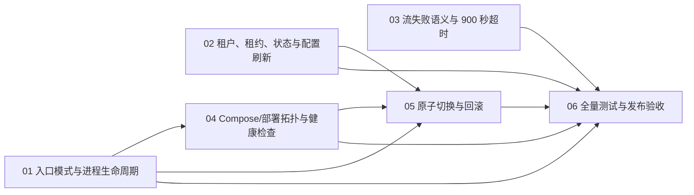

# 企业微信长连接独立 Worker 实施票据

- **任务 ID**：`wecom-dedicated-worker`
- **阶段**：`dev-spec-gen / to-tickets`
- **期望修订**：`12`
- **规格**：`docs/engineering/specs/2026-08-22-wecom-dedicated-worker-spec.md`
- **设计**：`docs/engineering/plans/wecom-dedicated-worker-design.md`
- **调研**：`docs/engineering/plans/wecom-dedicated-worker-gitnexus-inquiry.md`
- **状态**：本文件为正式 tickets 产物；各票据初始状态为 `ready-for-agent`。
- **本阶段边界**：只拆分任务，不修改生产代码、测试、canonical 编排 YAML，不提交、部署或写入节点状态。

## 拆分原则与证据边界

- 每张票据交付一条可独立验证的完整行为链；票据内的实现可以跨入口、运行时、部署配置和测试，但不把无意义的单行改动单独成票。
- 现有租约、消息状态、reconciler、协议和 App 流逻辑优先复用；只有回归暴露缺口时才做最小实现修改。
- GitNexus 当前未提供 Dify 仓库。实现者不得把本地检索结果当作完整调用图；部署唯一事实源、进程健康检查工具及停止宽限期必须在对应票据中通过现状核验后锁定，不得凭文件名猜测。
- 健康检查、停止宽限期、900 秒超时的现有归属等未确认项，必须记录最终选择和验证证据；不能新增第二套相互冲突的机制。

## 依赖图与并行安排

- **可并行起步**：01、02、03 彼此没有本需求内的阻塞关系，可并行实施。它们都必须先确认并复用现有运行时契约，不得各自复制一套长连接逻辑。
- **必须串行的部署门槛**：04 必须在 01 的启动模式契约确定后收口；05 必须等 01、02、04 的生命周期、租约释放和服务拓扑都可观察后实施；06 是最终门槛，必须等 01–05 完成。
- **不构成阻塞的既有前置**：上一轮已经确认的取消/断流语义和固定安全文案视为现有行为契约；03 负责把它们在拆分后锁成回归验收，而不是等待另一个本任务票据重新设计。

## 需求覆盖矩阵

| 规格要求 | 覆盖票据 |
| --- | --- |
| `MODE=wecom_long_link`、直接运行模块、SIGTERM、退出码 | 01 |
| `wecom_worker` service、运行时复用、开关隔离、迁移关闭、restart、进程健康 | 04 |
| 原子切换与回滚、不得新旧连接并行 | 05 |
| 租约、消息状态、多租户、30 秒配置刷新和版本重建 | 02 |
| App/LLM 失败终止帧、固定安全文案、保持 WebSocket | 03 |
| 取消、断流、发送失败不补帧及迟到事件保护 | 03 |
| 900 秒默认长流超时 | 03 |
| 单元、集成、Compose smoke、部署验收、回滚和兼容回归 | 06（并由 01–05 分担专项测试） |

---

# 01 — 锁定专用入口模式与进程生命周期

**What to build：** 运行时识别 `MODE=wecom_long_link` 后，只启动企业微信长连接主模块 `python -m core.wecom_long_link.worker`，不再经过 Celery 或 supervisor；服务收到 SIGTERM 时可完成有序收尾并以明确退出码结束，且现有其他启动模式保持不变。

**Blocked by：** None — 可立即开始；与 02、03 并行。

**Status：** `ready-for-agent`

### 目的

建立独立 Worker 的最小启动和停止契约，使容器内只有目标长连接主进程，并将正常退出、致命失败、租户级异常的边界固定下来，避免专用服务意外启动 Celery、supervisor 或第二个长连接进程。

### 范围

- 入口模式分派：新增 `MODE=wecom_long_link`，直接执行现有长连接模块；保留 `MODE=worker`、API、beat、job 等既有分支行为。
- 进程生命周期：启动 app context、进入现有租户运行循环、停止配置刷新和新消息处理、关闭连接、停止心跳/续租并释放租约。
- 信号与退出码：正常 SIGTERM 收尾以 0 退出；启动或不可恢复的全局初始化/主进程致命错误以非 0 退出交给 Compose 重启；单租户异常不得被误判为全局致命错误。
- 空配置启动：没有可用企业微信 endpoint 时保持单一主进程健康等待，不伪造连接、不启动第二个模块。
- 只补足入口所需的最小测试 seam；不在本票据重新实现 client、reconciler 或 App 流处理。

### 依赖与并行关系

- 无本任务票据依赖，可与 02、03 并行。
- 04 依赖本票据确认的 mode、主进程和退出契约；05、06 也以本票据的生命周期结果为前提。

### 验收条件

- [ ] `MODE=wecom_long_link` 的实际进程树只有一个对应的长连接主进程；没有 Celery、supervisor 或第二个长连接 worker。
- [ ] 专用模式使用 `python -m core.wecom_long_link.worker`，且不会落入通用 `MODE=worker` 的 supervisor 分支。
- [ ] `MODE=worker` 的既有 Celery 启动参数、队列和其他启动模式行为没有回归。
- [ ] 收到 SIGTERM 后停止刷新和新消息接收，关闭各租户 WebSocket，停止 ping/lease renewal，释放 lease，并在选定的停止宽限期内以 0 退出。
- [ ] 全局初始化或主进程不可恢复错误以非 0 退出；单租户连接、配置或 reconcile 错误只进入租户级恢复路径，不让主进程退出。
- [ ] 无企业微信配置时主进程仍可被进程级检查识别为存活，且没有额外连接或额外 worker 副作用。
- [ ] SIGTERM 收尾不发送 App 失败补偿帧，遵守取消/断流/发送失败的不补帧语义。

### 测试

- [ ] 入口模式单元/进程测试：覆盖专用模式、通用模式、未知或缺失模式的既有失败/默认行为。
- [ ] 最小子进程测试：观察命令行、子进程数量、正常 SIGTERM 退出码和致命错误非 0 退出码。
- [ ] 信号收尾测试：使用 fake client、lease store 和刷新任务，验证停止顺序和清理只发生一次。
- [ ] 空租户/无 endpoint 测试：确认服务保持存活且不启动第二个长连接。

### 风险

- 入口分支若只检查环境变量而未观察实际进程，可能表面配置正确但仍启动 supervisor；必须以进程行为验收。
- SIGTERM 等待时间过短会留下 WebSocket 或 lease，过长会阻塞发布；实现时需记录实际停止宽限期及超时处置。
- 把租户级错误提升为进程级异常会造成全租户失联；需在主循环和租户任务边界分别验证。

### 明确不做

- 不改写企业微信协议、client、reconciler 或 App 调用逻辑。
- 不新增 supervisor、Celery 永久任务、HTTP health endpoint 或对外端口。
- 不通过额外进程实现健康检查，也不在健康检查中再次执行长连接模块。
- 不修改数据库 schema、Redis key namespace、租约算法或迁移职责。

---

# 02 — 回归租户、租约、消息状态与配置刷新

**What to build：** 一个 `wecom_worker` 副本可遍历全部租户，并沿用既有 reconciler、Redis lease、消息状态和幂等语义；配置新增、删除、禁用或版本变化能在 30 秒刷新周期内以“先停旧连接、后建新连接”生效，单租户故障不会拖垮其他租户。

**Blocked by：** None — 可立即开始；与 01、03 并行。

**Status：** `ready-for-agent`

### 目的

证明容器拆分不会改变连接所有权、租户隔离、配置重载、消息幂等和失败重试语义；优先增加回归保护，只有现有 seam 无法满足契约时才做最小实现修改。

### 范围

- 全租户承载：复用现有租户枚举和任务编排，在一个服务副本内隔离各租户的 reconciler/client 任务。
- 配置刷新：固定 30 秒刷新周期；覆盖 endpoint 新增、删除、禁用、配置不完整以及配置版本变化。
- 连接替换：配置版本变化或 endpoint 替换时，旧 client 的任务、WebSocket 和 lease 完成收尾后才建立新 client。
- 租约与状态：继续使用现有 lease、message、processing key 和原子操作；验证 `PROCESSING`、`DIFY_COMPLETED`、`REPLY_SENT` 及 processing reset 的既有顺序和一次性语义。
- 幂等重放：已完成但发送失败的消息沿用缓存结果重发；已 `REPLY_SENT` 的消息跳过重复处理。
- 安全边界：secret 只在受控运行时内存使用，不进入日志、Redis 状态、任务参数、状态响应或连接标签。

### 依赖与并行关系

- 无本任务票据依赖，可与 01、03 并行。
- 05 依赖本票据的 lease 释放与先停后建证据；06 等待本票据专项测试通过。

### 验收条件

- [ ] 一个专用服务副本能为多个租户各自创建和维护连接；一个租户的配置、连接、租约或 reconcile 异常不会取消其他租户任务或退出全局进程。
- [ ] 配置新增、删除、禁用和不完整配置在最多一个 30 秒刷新周期内被发现并按既有语义处理。
- [ ] 配置版本变化先停止旧 client，等待任务收尾和 lease 释放，再创建新 client；不存在同一 Bot 的并行有效连接。
- [ ] 未取得 lease 的 client 不得订阅、处理或发送；续租失败沿用既有关闭和重连路径。
- [ ] 消息状态仍按既有语义迁移：成功才允许 `DIFY_COMPLETED`/`REPLY_SENT`，失败路径不写成功状态，processing 只重置一次。
- [ ] `DIFY_COMPLETED` 的可复用结果只重发回复而不再次调用 App；`REPLY_SENT` 消息跳过重复处理。
- [ ] 既有 Redis key 组成、schema 和状态字段保持不变；测试中没有新增 namespace 或清理历史 key 的旁路逻辑。
- [ ] secret、完整凭据和原始异常未出现在日志、Redis message content、状态响应、任务参数或监控标签中。

### 测试

- [ ] 多租户集成测试：至少覆盖两个租户，其中一个配置/连接失败时另一个仍能订阅、接收和重连。
- [ ] reconciler 回归测试：覆盖新增、禁用、删除、缺失配置和版本变化，并断言 stop-before-start 及刷新周期。
- [ ] 受控 lease/state store 测试：覆盖竞争获取、续租失败、释放、消息 claim、重复消息、已完成重放、已发送跳过和单次 reset。
- [ ] 迟到任务/旧配置结果测试：旧 client 收尾后的事件不能覆盖新配置或写入成功状态。
- [ ] secret 边界测试：检查日志、状态和任务参数输出不含 secret 或原始错误。

### 风险

- 单副本降低竞争概率但不能替代 lease；若实现绕过 lease，回滚或误启动旧服务时仍会重复订阅。
- 先停后建若只依赖 lease 自然过期，可能产生并行窗口；必须观察 client 任务、WebSocket 和 lease 三者收尾。
- 全租户 `gather` 的异常传播可能取消其他租户；必须保留租户级异常隔离。
- 状态回归若只检查 Redis 最终值而不检查调用次数，可能遗漏重复 App 调用或重复 reset。

### 明确不做

- 不新增数据库 schema、Redis key namespace、状态字段或新的 lease 算法。
- 不按租户创建容器/进程，不以多副本实现高可用。
- 不重写消息幂等、App 调用、协议适配或现有 provider 配置模型。
- 不把迁移、清理旧 key 或人工数据修复放入长连接 worker。

---

# 03 — 锁定流失败帧、取消语义与 900 秒超时

**What to build：** 拆分后的长连接继续使用同一 `stream_id` 完成正常流和 App/LLM 失败终止帧；App/LLM 失败只发送一次固定安全 `finish=true` 帧并保持 WebSocket 可接收下一条消息，而取消、断流和发送失败不发送任何补偿帧；默认长流超时保持 900 秒。

**Blocked by：** None — 可立即开始；与 01、02 并行。

**Status：** `ready-for-agent`

### 目的

把上一轮已确认的长流失败修复固化为拆分后的回归契约，防止专用进程、停止处理或错误分类把内部异常泄露给企业微信用户，或把取消/断流伪造成正常完成。

### 范围

- 正常流：复用稳定 `stream_id`、原始 `req_id` 和唯一 `finish=true` 终止帧，保持 WebSocket 接收后续消息。
- App/LLM 失败：覆盖 App、Plugin 流、模型调用、流转换异常以及长流超时；对外固定发送一次安全终止帧，文案固定为“服务暂时不可用，请稍后重试。错误码：`APP_STREAM_ERROR`”。
- 失败发送：终止帧发送失败时不再发送第二个补偿帧；processing 按既有失败路径只重置一次。
- 取消/断流：停止 timer、feedback、生产事件和迟到回调，不发送终止或补偿帧，不写 `DIFY_COMPLETED`/`REPLY_SENT`。
- 超时：确认现有长流超时的唯一归属和默认值为 900 秒；通过现有配置/注入 seam 验证，不新增冲突的第二套超时。
- 日志边界：原始错误、异常类型和 traceback 只进入受控内部日志；不进入企业微信帧、Redis 状态或健康检查结果。

### 依赖与并行关系

- 无本任务票据依赖，可与 01、02 并行；依赖上一轮已确认的既有协议和取消行为，不重新设计协议。
- 06 依赖本票据专项测试通过；T05 不以本票据作为部署拓扑的直接阻塞，但最终切换验收必须包含本票据的行为回归。

### 验收条件

- [ ] 正常 App 流的中间帧和最终帧使用同一 `stream_id`，且只产生一个正常 `finish=true` 帧。
- [ ] App/LLM 失败最多发送一个同一 `stream_id` 的固定安全 `finish=true` 帧；对外文案不包含原始错误、traceback、secret 或内部标识。
- [ ] App/LLM 失败终止帧发送后，当前 WebSocket 仍可接收并处理下一条消息；一次失败不会使 Bot 永久失联。
- [ ] 长流超时默认值为 900 秒，拆分服务没有引入冲突默认值；超时属于 App/LLM 失败时沿用固定安全终止帧语义。
- [ ] 用户取消、任务取消、WebSocket 断流和企业微信发送失败均不发送终止/补偿帧；发送失败不重试发送终止帧。
- [ ] 取消/断流后的迟到 event、frame、final 或生成器返回值不能写入成功状态、重新入队或恢复反馈。
- [ ] 失败路径不进入 `DIFY_COMPLETED`/`REPLY_SENT`，processing 只重置一次；正常完成的状态迁移保持不变。
- [ ] 原始 App/LLM 错误可在内部日志中关联 invocation/request，但不会出现在 Redis、状态接口、任务参数或 healthcheck 输出。

### 测试

- [ ] fake WebSocket/stream 单元测试：覆盖正常中间帧、稳定 `stream_id`、唯一 finish、App 异常和固定安全文案。
- [ ] 错误分类测试：覆盖 App/LLM 异常、流转换异常和注入式 900 秒超时，断言只产生一次失败终止帧。
- [ ] 取消/断流/发送失败测试：断言无新增补偿帧、timer/feedback/生产事件停止、processing 单次 reset 和 WebSocket/连接收尾。
- [ ] 迟到事件竞态测试：释放取消后的回调或生成器结果，确认不写成功状态、不重复调用 App。
- [ ] 配置契约测试：无覆盖配置时断言 900 秒；若使用环境变量或配置文件，确认它与现有超时入口为同一事实源。
- [ ] 日志与输出脱敏测试：确认完整异常只在内部日志，且对外帧、Redis 和健康检查无泄露。

### 风险

- 将 WebSocket 断流、取消或发送异常误归类为 App 失败会违反不补帧契约。
- 失败处理在多个层重复兜底可能发送两次 finish；必须由 invocation 级状态/收尾保证最多一次。
- 900 秒可能与 lease TTL、processing TTL 或其他连接 timeout 混淆；实现前需锁定唯一入口，不能通过新常量掩盖不确定性。
- 只断言帧内容而不验证连接可继续接收，会遗漏“失败后 Bot 失联”的回归。

### 明确不做

- 不把取消、断流或企业微信发送失败转换为安全终止帧。
- 不改变企业微信协议命令、`req_id` 透传、stream 字段或消息状态协议。
- 不向 Redis、状态接口、任务参数或用户消息写入原始 App/LLM 异常。
- 不新增另一套长流超时、lease TTL 或 processing TTL，也不擅自改变上一轮已确认的 900 秒默认值。

---

# 04 — 建立 Compose/部署拓扑与进程级健康检查

**What to build：** 最终渲染的 Compose/部署配置包含单副本 `wecom_worker`，复用现有 API 镜像、完整运行时环境和基础设施依赖，直接使用 `MODE=wecom_long_link`；通用 worker 和 `worker_graph` 明确关闭企业微信长连接，且专用服务不执行迁移、不启动第二个 worker。

**Blocked by：** 01 — 锁定专用入口模式与进程生命周期；可在 01 完成后开始，不能在入口契约未定时猜测配置。

**Status：** `ready-for-agent`

### 目的

把进程级拆分落到真正的 Compose service 和部署事实源，确保专用服务与现有 API/worker 运行时一致但故障域独立，并让配置、进程表和健康检查共同证明连接所有权没有漂移。

### 范围

- 服务拓扑：新增固定服务名 `wecom_worker`，使用与 API/worker 相同的镜像和版本；设置 `MODE=wecom_long_link`、`WECOM_LONG_LINK_ENABLED=true`、`MIGRATION_ENABLED=false`。
- 运行时复用：复用完整 env、DB、Redis、Plugin Daemon、Sandbox、storage mount、网络和既有依赖条件；不新增基础设施、端口或 Dockerfile。
- 既有 worker 隔离：通用 `worker` 显式关闭 WeCom；`worker_graph` 保持关闭且只消费 `graph_index`，不建立企业微信连接。
- 进程和副本：专用服务初始单副本，使用 `restart: always`；直接运行长连接主进程，不启动 Celery 或 supervisor。
- 健康检查：使用镜像内可用的进程级检查确认目标主进程存活，不执行长连接模块、不启动第二进程、不开放 HTTP health endpoint、不输出 secret。具体工具、间隔、重试、start period 和停止宽限期在实现时记录并验证。
- 事实源同步：先确认 Compose 的唯一生成/部署事实源，再同步生成结果或对应模板；不能只修改一份不会进入发布路径的派生文件。

### 依赖与并行关系

- 阻塞于 01 的 mode、命令和退出码契约。
- 可与 02、03 的运行时回归并行收尾；05 必须等待本票据的渲染和 smoke 证据。

### 验收条件

- [ ] 渲染后的 Compose 中存在 `wecom_worker`，使用同一 API 镜像/版本、完整 env、DB/Redis/Plugin Daemon/Sandbox/storage/网络和既有依赖条件。
- [ ] `wecom_worker` 明确设置 `MODE=wecom_long_link`、`WECOM_LONG_LINK_ENABLED=true`、`MIGRATION_ENABLED=false`，副本约束为 1，restart 策略为 `always`。
- [ ] `worker` 明确设置 `WECOM_LONG_LINK_ENABLED=false`；`worker_graph` 同样为 false，且 `CELERY_WORKER_QUEUES` 只有 `graph_index`。
- [ ] 专用 service 不启动 Celery、不经过 supervisor、不消费 Celery 队列、不新增对外端口；实际进程观察与渲染配置一致。
- [ ] 专用 service 不执行数据库迁移；迁移仍由既有 migration job 负责。
- [ ] 健康检查只检查已存在的目标主进程，能在无 endpoint 配置时保持合理健康，不启动第二个 worker、不创建 WebSocket、不泄露 secret。
- [ ] 最终渲染结果证明没有遗漏 worker 运行时依赖、mount、网络或权限条件；现有 API、业务 worker 和 graph worker 的非 WeCom 行为不被改变。

### 测试

- [ ] Compose 渲染/配置测试：断言 service、镜像、环境、命令、依赖、mount、网络、restart、副本和队列约束。
- [ ] 入口与进程 smoke：启动三类 worker，观察 `wecom_worker` 无 Celery/supervisor，通用 worker/graph worker 无企业微信连接。
- [ ] 健康检查 smoke：检查命令、退出码和副作用，确认不会启动第二个长连接或暴露 secret；覆盖无 endpoint 配置。
- [ ] migration smoke：以 `MIGRATION_ENABLED=false` 启动专用 service，确认没有迁移副作用。
- [ ] 依赖复用测试：在容器环境验证 app context、配置读取、DB/Redis、Plugin Daemon、Sandbox 和 storage 均可用。

### 风险

- 修改派生 Compose 文件而未修改真实生成入口，会导致本地看似通过、发布时丢失 service。
- 只复制 worker 的少量环境变量会使专用进程无法读取租户或调用 App/Plugin。
- 健康检查若执行模块本身，会实际建立第二条连接；若依赖 secret 参数，也会扩大泄露面。
- 单副本只是部署约束，错误的扩缩容或复制 service 仍可能造成连接竞争；渲染验收必须显式锁定。

### 明确不做

- 不新增 Dockerfile、API 镜像、DB、Redis、Plugin Daemon、Sandbox、storage、网络或对外端口。
- 不新增 HTTP health endpoint、独立健康服务、资源 limits、autoscaling 或多副本高可用方案。
- 不把企业微信长连接改为 Celery 任务、API 进程任务或新的 Trigger provider。
- 不在本票据执行生产部署或切换；切换和回滚由 05 定义、06 验收。

---

# 05 — 实现无并行连接的原子切换与回滚门槛

**What to build：** 发布人员能够先停止通用 worker 的旧企业微信长连接并确认进程、WebSocket 和 lease 全部释放，再启动 `wecom_worker`；回滚时反向执行“先停专用、后恢复通用”的顺序，任何阶段无法确认停止屏障时都不启动另一方。

**Blocked by：** 01、02、04 — 必须串行；需要入口退出契约、lease/配置收尾和最终 Compose 拓扑全部可观察。

**Status：** `ready-for-agent`

### 目的

将新旧连接所有权切换变成可执行、可观察、可中止的发布门槛，消除依赖 lease 自然过期或新旧服务短暂并行带来的重复订阅、消息竞争和状态竞态。

### 范围

- 原子切换顺序：关闭/重建通用 worker，使其不再持有 WeCom；等待 supervisor/旧长连接进程退出、WebSocket 关闭和 lease 释放；确认旧进程不存在后再启动专用 service。
- 启动后验证：确认专用主进程、订阅日志、租约和单 Bot 连接所有权；检查通用 worker/graph worker 没有重新抢占。
- 停止屏障：提供现有 Compose/deploy 能执行或明确调用的只读确认步骤；屏障未满足时发布失败并保持停止状态，不以并行运行换取速度。
- 回滚顺序：先停止 `wecom_worker` 并确认连接/lease 释放，再切换上一版 Compose/镜像，恢复通用 worker 的 WeCom 开关，确认旧 supervisor/长连接接管且专用 service 未运行。
- 数据兼容：切换和回滚只使用现有状态、key 和镜像/Compose 版本，不执行迁移、namespace 清理或数据改写。

### 依赖与并行关系

- 这是部署串行门槛，阻塞于 01、02、04；不允许绕过依赖直接做灰度并行。
- 03 可并行完成，但 06 的最终发布验收必须同时覆盖 03 的帧与状态语义。

### 验收条件

- [ ] 切换步骤明确先停旧通用长连接，再等待 supervisor/子进程、WebSocket 和 lease 释放，最后才启动 `wecom_worker`。
- [ ] 停止屏障能通过进程表、连接/订阅日志和 lease 状态观察；任何旧长连接仍存在时不会启动新长连接。
- [ ] 切换完成后同一 Bot 在任意观察窗口最多有一个有效连接所有者；通用 worker 和 graph worker 不建立 WeCom 连接。
- [ ] 切换中断或新服务启动失败时，不会自动保留新旧两套连接；可安全停留在无连接状态并按运行手册恢复。
- [ ] 回滚先停止专用 service 并确认 lease 释放，再恢复上一版通用 worker 的 WeCom 开关；回滚后专用 service 停止、通用长连接恢复且无并行连接。
- [ ] 回滚不执行数据库迁移、不修改 Redis key namespace、不清理或合并消息状态，既有 `PROCESSING`/`DIFY_COMPLETED`/`REPLY_SENT` 语义可继续使用。
- [ ] 发布/回滚验收记录实际使用的 Compose/镜像版本、停止确认、主进程、连接所有权和失败处置结果。

### 测试

- [ ] 受控 Compose 切换 smoke：先运行旧拓扑，再按顺序切换，采集进程表、WebSocket/订阅日志和 lease 状态，证明无重叠窗口。
- [ ] 停止屏障失败测试：人为保留旧进程或 lease，确认流程拒绝启动新服务而不是等待 lease 自然过期或并行运行。
- [ ] 回滚 smoke：专用服务运行期间执行停止、版本切换和通用 worker 恢复，确认连接所有权唯一且状态/key 未被改写。
- [ ] 重启/异常测试：专用主进程异常退出后由 `restart: always` 拉起，恢复过程中仍不产生第二个有效持有者。
- [ ] 运行手册验收：每个只读观察步骤在部署环境可执行，输出不含 secret。

### 风险

- 部署工具可能无法原子表达“停止并等待确认后再启动”；此时必须增加最小可观察屏障或显式失败，不得默认并行。
- SIGTERM 宽限期不足会让 lease 仍被旧进程持有，造成新服务误判可启动；切换前必须观察而非只等待固定秒数。
- 回滚若直接切换镜像而不先停止专用 service，会造成同 Bot 双持有；顺序是不可省略的门槛。
- Compose `restart: always` 可能在切换期间自动拉起已停止的旧服务；需要把服务停止状态纳入验收并避免隐式重启。

### 明确不做

- 不采用新旧服务并行的灰度、蓝绿、竞态等待或“让 lease 自然过期”策略。
- 不新增多副本、高可用 lease 算法、跨租户迁移或新的连接所有权服务。
- 不执行数据库迁移、Redis namespace 清理、消息状态重写或人工数据合并。
- 不在本票据直接执行生产发布、回滚或提交；只交付可验证的流程和自动化/手册门槛。

---

# 06 — 全量测试、Compose smoke、部署验收与回滚交付门槛

**What to build：** 提供一套从单元、集成到 Compose 和部署观察面的最终验收，证明独立 Worker 的启动拓扑、租户/租约/状态、流式错误语义、900 秒默认值、切换/回滚以及 API、Celery、Graph 兼容回归全部满足规格；未能在当前环境执行的检查必须明确记录，不得将未验证标成通过。

**Blocked by：** 01、02、03、04、05；这是最终串行交付门槛。

**Status：** `ready-for-agent`

### 目的

把各专项票据的行为证据汇总为可复核的发布判定，优先观察外部结果（渲染后的 Compose、实际进程、WebSocket 帧、Redis 状态、结构化日志和回滚结果），避免只依赖私有实现细节或静态环境变量。

### 范围

- 单元回归：入口分派/信号、reconciler/配置刷新、lease/state、协议/feedback、App/LLM 失败、取消/断流/发送失败和 900 秒配置。
- 集成回归：多租户隔离、stop-before-start、幂等重放、processing reset、secret 边界、App 失败后 WebSocket 继续接收。
- Compose smoke：服务、镜像、env、命令、依赖、mount、网络、restart、单副本、队列、migration 开关和进程健康检查。
- 部署验收：原子切换停止屏障、单 Bot 连接所有权、异常自动重启、回滚顺序及状态/key 兼容。
- 兼容回归：既有企业微信协议行为、API、Celery 业务队列、Graph 索引和非 WeCom 运行模式。
- 交付记录：列出执行命令、环境、观察证据、未执行项目及原因；不得修改 canonical 编排 YAML 来绕过失败。

### 依赖与并行关系

- 必须等待 01–05 完成并通过各自验收；本票据不得替代任何专项票据的实现或测试。
- 测试编写可在 01–05 实施期间分别并行，但最终汇总、Compose smoke、部署验收和回滚判定必须串行完成。

### 验收条件

- [ ] 入口/进程验收证明专用模式只运行目标长连接模块，SIGTERM 正常退出并释放连接；通用 worker 和 graph worker 不建立 WeCom 连接。
- [ ] Compose 渲染验收证明 `wecom_worker` 使用同镜像和运行时依赖、单副本、`restart: always`、`MIGRATION_ENABLED=false`、进程级 healthcheck，且 graph worker 仅消费 `graph_index`。
- [ ] 多租户与配置验收证明 30 秒刷新、版本先停后建、单租户故障隔离、lease 排他和既有消息状态/幂等语义保持不变。
- [ ] 帧与错误验收证明正常流的稳定 `stream_id`/唯一 finish、App/LLM 失败的固定安全终止帧、失败后 WebSocket 可继续工作，以及取消/断流/发送失败不补帧。
- [ ] 超时验收证明无覆盖配置时长流默认 900 秒，且没有与 lease/processing/连接超时冲突的第二默认值；使用注入式超时测试避免为验收等待 900 秒。
- [ ] 原子切换和回滚验收证明旧连接完全停止并释放后才启动新连接，回滚先停专用再恢复通用，任何阶段无新旧并行连接。
- [ ] 运行日志、Redis、状态、任务参数和 healthcheck 输出不包含 secret、完整凭据或原始 App/LLM 异常；内部日志仍可用于排障。
- [ ] 现有 WeCom、API、Celery、Graph 和其他启动模式回归通过；失败时明确区分本次变更回归、环境缺失和未执行项。
- [ ] 交付清单确认本次实现未新增 schema/key namespace/端口/基础设施，未修改 canonical 编排 YAML，未以未验证结果宣称发布可用。

### 测试

- [ ] 运行 01–03 列出的定向单元和集成测试，保留失败场景的状态、调用次数和帧数量断言。
- [ ] 执行渲染后的 Compose smoke，并采集 service 配置、进程表、健康检查退出码、依赖可用性、结构化日志和租约观察结果。
- [ ] 执行受控切换和回滚 smoke，记录停止屏障、单 Bot 所有权、自动重启和状态/key 保持情况。
- [ ] 运行既有企业微信、API、Celery、Graph 相关回归；对无法启动完整容器或无法连接外部依赖的场景记录未执行原因和后续 CI 入口。
- [ ] 执行静态变更清单审查：确认没有引入第二套 App 流、协议、租约、超时或健康服务实现。

### 风险

- 本地环境可能无法完成真实 Compose/部署回滚；只能把可复现的 smoke 步骤和未验证项交给 CI/发布环境，不能把配置静态检查等同于部署通过。
- 仅运行单元测试无法发现 Compose 依赖、进程拓扑或停止屏障问题；最终门槛必须包含外部观察。
- 900 秒真实等待不适合作为 CI 默认测试；应验证唯一配置入口和注入式过期行为，同时记录未执行真实时长流。
- GitNexus 不可用导致影响范围证据受限；交付记录应注明 local_search/non_gitnexus 边界，不能声称已覆盖完整调用图。

### 明确不做

- 不在本票据修改生产代码、测试之外的业务范围、canonical 编排 YAML 或其他需求文件。
- 不以跳过 Compose、部署、回滚或安全边界检查来获得“全绿”。
- 不执行生产部署、真实回滚、节点提交、git commit 或 push；本票据只定义和执行（在授权环境内）验收证据。
- 不为本需求增加多副本高可用、资源限制、HTTP health endpoint、独立基础设施或新的状态/租约机制。

---

## 交付完成判定

只有在 01–05 的专项验收均完成，且 06 的单元、集成、Compose smoke、切换/回滚和兼容回归结果可复核时，才可将本任务标记为实现完成。任何未确认的 Compose 事实源、健康检查参数、停止宽限期、900 秒配置归属或全局依赖失败策略，都必须在实现票据或验收记录中显式写出最终选择，不能留给发布现场猜测。
